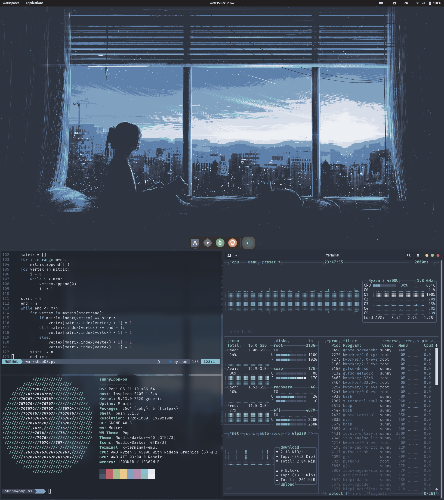

# End result

# Configuration

These are my config files for a clean, dark [Nord](https://www.nordtheme.com/) look with a touch of blurred transparency on GNOME 40. At the time of uploading, I am using this configuration on Pop!_OS 21.10 running GNOME 40.5.
To get started, download this repository and follow the steps below. As with all configs, mine is highly up to personal choice. Feel free to tweak any of these files to your own liking.

Original Nord colour palette by [articicestudio](https://github.com/arcticicestudio).

1. [Application and Shell theme](#app-and-shell)
2. [Icon theme](#icon-theme)
3. [Cursor theme](#cursor-theme)
4. [Fonts](#fonts)
5. [Alacritty](#alacritty)
6. [Neovim and Lualine](#neovim-and-lualine)
7. [Blur Me](#blur-me) (extension for transparency blur)
8. [oh-my-bash](#oh-my-bash)
9. [Gedit](#gedit)
10. [Visual Studio Code](#vs-code)
11. [btop](#btop)
12. [Wallpapers](#wallpapers)

### Application and Shell theme

For the application and shell themes, [Nordic Darker v40](https://www.gnome-look.org/p/1267246/) by [EliverLara](https://www.gnome-look.org/u/eliverlara) is used. Click on the link, go to **Files**, download **Nordic-darker-v40.tar.xz** and extract its contents into your `$HOME/.themes` directory. Create a `.themes` directory if it does not exist:

    mkdir $HOME/.themes

Change the Application and Shell themes to **Nordic-darker-v40** via GNOME Tweaks.

### Icon theme

The icon theme used is Zafiro. As we want our folder icons to be Nord-themed as well, we use [Nordic Folders icon pack Mod](https://www.gnome-look.org/p/1473069/) by [theglitchh](https://www.gnome-look.org/u/theglitchh). It includes the standard Zafiro icons with the folders replaced by Nordic Darker folder icons. Click on the link, go to **Files**, download **Nordic-Darker-mod.tar.xz** and extract its contents into your `$HOME/.icons` directory. Create a `.icons` directory if it does not exist:

    mkdir $HOME/.icons

Change the Icon theme to **Nordic-Darker** via GNOME Tweaks.

### Cursor theme

I use [Norzy-cursors](https://www.gnome-look.org/p/1571937) by [alvatip](https://www.gnome-look.org/u/alvatip). Click on the link, go to **Files**, download **Nordic-Darker-mod.tar.xz** and extract its contents into your `$HOME/.icons` directory. 

Change the Cursor theme to **Nordzy-cursors** via GNOME Tweaks.

### Fonts

I use [Fira Sans Book](https://www.fontsquirrel.com/fonts/fira-sans) for my interface font and Fira Code as my default monospaced/terminal font. For logos, glyphs and other special characters to be displayed correctly in Neovim's Lualine plugin (more on that later), I use a patched version of Fira Code. Just go to the **Fira-Code-patched** folder and install the variants you need. The folder was originally downloaded from [Nerd Fonts](https://www.nerdfonts.com/font-downloads).

To set your default interface and monospaced fonts, use GNOME Tweaks.

### Alacritty

Install the [Alacritty](https://github.com/alacritty/alacritty) terminal emulator. Move the **alacritty** folder into `$HOME/.config`. If you prefer the default GNOME Terminal, refer [here](https://github.com/arcticicestudio/nord-gnome-terminal).

### Neovim and Lualine

I use [Neovim](https://github.com/neovim/neovim) as my terminal text editor. After installing it, drag the **nvim** folder into `$HOME/.config`. Create a directory called `plugged` inside `nvim`. 

    mkdir $HOME/.config/nvim/plugged

To install Neovim plugins, I use a plugin manager called [vim-plug](https://github.com/junegunn/vim-plug). To install it, run this command:

    sh -c 'curl -fLo "${XDG_DATA_HOME:-$HOME/.local/share}"/nvim/site/autoload/plug.vim --create-dirs \
        https://raw.githubusercontent.com/junegunn/vim-plug/master/plug.vim'
        
Open up Neovim (there should be an error message on first startup, just ignore it) and run `:PlugInstall`. 

My configuration of Neovim uses a statusline plugin called [Lualine](https://github.com/nvim-lualine/lualine.nvim). If you do not like the look of it, you can edit it in **init.vim**. Lualine's GitHub page contains a very detailed explanation of configuration options as well as instructions. As it may be hard to type out the default separator characters (if you wish to use them) that come with Lualine, I included them in a plain text file called **Lualine-default-separators** from which you can copy and paste.

Sometimes, Neovim's Nord colour scheme may contradict with that of Lualine's. If this happens, drag **nord_new.lua** into Lualine's themes folder. Assuming you are in the root of this repository:

    mv nord_new.lua $HOME/.config/nvim/plugged/lualine.nvim/lua/lualine/themes
   
Then, replace line 19 of **init.vim** with `theme = 'nord_new',`. This should correct the Nord colour scheme of Lualine.
   
### Blur Me

To add blur to our transparent Alacritty/GNOME Terminal and Neovim windows, install the [Blur Me](https://extensions.gnome.org/extension/4236/blur-me/) GNOME extension by [nunchucks](https://extensions.gnome.org/accounts/profile/nunchucks). 

NOTE: To add transparency to the GNOME Terminal, open it and go to **Preferences**. Select your profile in the **Profiles** section, go to **Colours**, and enable **Use transparent background**.

### oh-my-bash

To customise the Bash prompt, install [oh-my-bash](https://github.com/ohmybash/oh-my-bash) (if you use Zsh, refer to [ohmyzsh](https://github.com/ohmyzsh/ohmyzsh)). Then, replace `$HOME/.bashrc` with the one included in the repository **(don't forget to add a '.' at the front of the filename)**. 

I use the Agnoster theme. You can refer to the available themes for oh-my-bash on its Github page and change it in line 6 of **.bashrc**. If you use conda environments, the original Agnoster theme does not display them. To fix this, replace `$HOME/.oh-my-bash/themes/agnoster/agnoster.theme.sh` with the one included in the repository. I personally hide the git prompt. If you want git branches to be displayed, uncomment line 422 in `agnoster.theme.sh`.

### Gedit

I use GNOME's default GUI text editor from time to time. Follow the readme instructions [here](https://github.com/arcticicestudio/nord-gedit) to install a Nord theme for Gedit.

### Visual Studio Code

If you use VS Code or VS Codium, go to the Marketplace and search for [Nord](https://marketplace.visualstudio.com/items?itemName=arcticicestudio.nord-visual-studio-code).

### btop

I use a terminal system monitor called [btop](https://github.com/aristocratos/btop). It includes Nord as a theme option, which can be applied in the options.

### Wallpapers

I included three of my favourite Nord-themed wallpapers in the **wallpapers** folder. More can be found [here](https://github.com/linuxdotexe/nordic-wallpapers).
